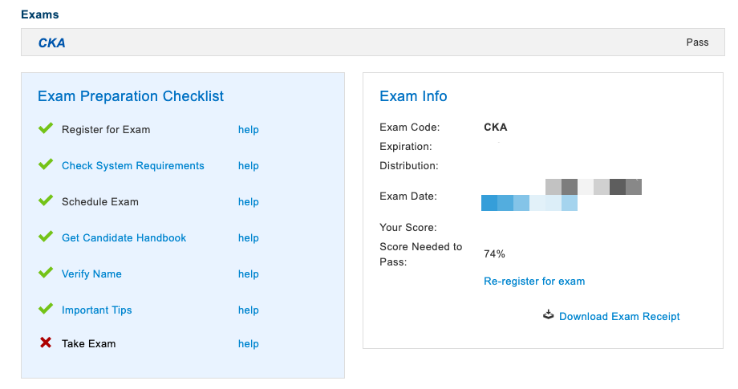
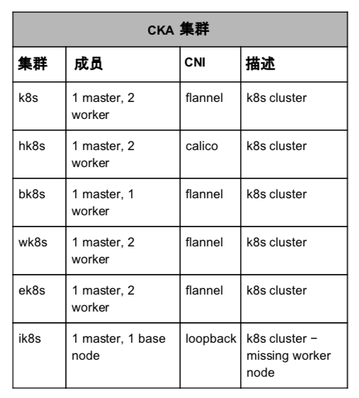
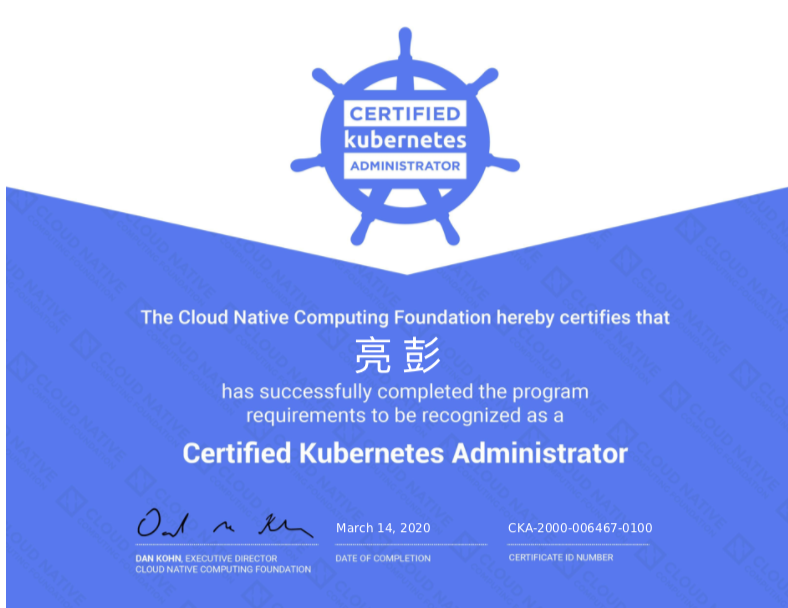

## CKA介绍

Kubernetes是现在最主流的容器编排管理技术，随着kubernetes的功能越来越强大，生态越来越复杂，kubernetes管理复杂度提升，而越来越多的企业使用容器和kubernetes，企业对kubernetes管理员的需求日渐提升。

CKA（Certified Kubernetes Administrator https://www.cncf.io/certification/cka/）是CNCF提供的kubernetes管理员认证，是目前最主流的kubernetes认证，认证好处官方描述如下：

> “ Kubernetes管理员认证(CKA)旨在确保认证持有者具备履行Kubernetes管理员职责的技能，知识和能力。CKA认证可帮助经过认证的管理员在就业市场中快速建立自己的信誉和价值，并能帮助公司更快地雇用高质量的团队来支持他们的发展。”

本文作者总结准备、考试过程中经验，期望能够为希望获取CKA认证的人员提供帮助。

## CKA流程

打开官网后能看到很清晰的说明，注册考试后有如下的步骤指引，按步进行即可

1. 在官网上下单注册考试，费用300美元（https://www.cncf.io/certification/cka/），包含一次免费重考
2. 进入考试首页portal（https://training.cncf.io/portal），按步骤检查系统要求，安排考试时间（会有邮件通知）等

3. 点击链接，获取材料文档，包括：考生手册、常见问题、考试小贴士等
4. 学习、准备考试（相见准备工作）
5. 在规定考试时间参加考试（建议提前15分钟进入状态）

一般考试完后24小时内在认证首页portal可查，36小时内收到通知邮件

## 考试形式

一些关键的考试信息包括：

1. 考试时间为3个小时，时间是比较紧张的，尽量中途不要上厕所离开
2. CKA考试共有24个题目，都是实操题，每个题目有不同的分值（越难分值越高），共100分，及格标准为74%
3. 考试期间只能最多打开2个tab页面，一个是考试页面，一个是可访问的资源内容，包括
https://kubernetes.io/docs/​ 及其子域
https://github.com/kubernetes/​ 及其子域
https://kubernetes.io/blog/
4. 考试的操作系统是ubuntu 16，kubernetes版本会每季度更新（2020年3月考试使用的是V1.17）
5. 考试当天的主要形式是（由于进入考试后不允许其他操作，因此没有截图）
    * 到考试时间后，可以从portal页面进入考试
    * 等待监考人员上线
    * 监考人员上线后需要打开屏幕共享和摄像头、麦克风
    * 监考人员会在网页右下角发文字（英文），让你
          * 展示身份证
          * 展示清空的桌面
          * 展示四周环境（切记不要用台式机，不然举电脑很痛苦）
          * 关掉所有其他进程
    * 等等
6. 监考人员会告诉你其他考试要求，基本回复OK就行
7. 监考人员会启动考试，考试界面顶部是控制考试结束、暂停等操作菜单，左侧是题目，右侧是web shell（和ubuntu命令行体验基本一致）
8. 做完告诉监考人员I am done
9. 点击提交考试
10. 结束

## 准备工作

CKA认证考试难度不高，但需要对各类基本概念以及任务比较熟悉，且考试内容基本都是在用kubectl，因此建议的考试准备工作有：

1. 多看几遍官方文档，包括cheatsheet，一定熟悉官网的各种内容（☆☆☆☆☆）
https://kubernetes.io/blog/
https://kubernetes.io/docs/reference/kubectl/cheatsheet/
2. 至少走一遍通过基本操作部署集群（etcd、ssl、firewall等）（☆☆☆☆）
https://github.com/kelseyhightower/kubernetes-the-hard-way
3. 至少走一遍通过kubeadm部署集群（☆☆☆☆）
4. 其他可以看看经验贴、youtube视频培训视频等（☆☆☆）

## 经验技巧

1. 要有一个稳定的翻墙梯子
2. 认证关联账号尽量使用github等能够不用翻墙使用的账号，包括邮箱
3. 考试尽量使用笔记本，因为开始考试前，监考人员需要打开摄像头和麦克风，查看四周情况
4. 考试期间最常用的网站是官方网站，内容都要熟悉
5. 使用一些提升效率的方法
    * 使用tmux
    * cat <<EOF | kubectl create -f -
6. kubectl要精通，熟悉一些快速创建的方法，比如 kubectl run 等
7. 多用官网的已有代码来创建对象或命令，有需要可以使用搜索功能
8. 熟悉systemctl系统管理
9. 遇到不熟悉或没把握的题目先标记跳过，做完简单的再回头做
10. 看清楚题目要求的k8s集群，先用kubectl config use-context k8s切过去，具体集群见考试说明，示例如下

## 祝大家尽早获得证书

